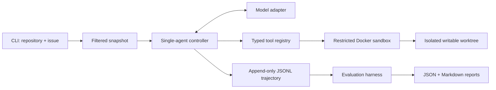

# RepoPilot

RepoPilot is an evaluated coding agent that takes a local Python repository plus a natural-language issue, explores the codebase, applies a patch, runs pytest inside a restricted Docker container, repairs failures, and returns an auditable diff.

The project is intentionally narrow: one capable agent, six controlled tools, one sandbox boundary, and a small hidden-test benchmark. It demonstrates repository-level agent engineering without adding RAG, memory, a UI, multi-agent orchestration, a database, or deployment infrastructure.

## What it demonstrates

- A real tool-calling loop: **inspect → locate → plan → edit → test → repair → final diff**
- Repository tools with typed inputs instead of arbitrary shell access
- Docker isolation for repository reads, writes, patching, Git inspection, and test execution
- Append-only JSONL trajectories with actions, observations, timing, and token usage
- Deterministic infrastructure regression plus separate live-model evaluation
- Hidden-test scoring and behavior metrics beyond a pass/fail demo

## Architecture



The model decides what to inspect and change. The controller owns budgets, tool dispatch, trajectory recording, the final test run, and the final diff. A model's claim that a task succeeded is never treated as evidence.

### Agent loop

```text
inspect files
    ↓
search and read relevant code
    ↓
state a concise plan
    ↓
apply a unified diff
    ↓
run fixed pytest command
    ├── failure → inspect observation → revise, within repair budget
    └── pass    → inspect final diff → finish
```

Default limits are 30 model iterations, three failed edit/test repair cycles, a 30-second command timeout, a five-minute overall deadline, and bounded observations and patches.

## Controlled tools

| Tool | Capability | Main controls |
|---|---|---|
| `list_files` | Enumerate repository files | Relative paths, result cap, cache exclusions |
| `search_code` | Literal or regex code search | Query, file-size, and match caps |
| `read_file` | Read numbered line ranges | Workspace resolution, 400-line maximum |
| `apply_patch` | Apply a Git diff or `*** Begin Patch` envelope | Path validation, size cap, protected tests, no symlink/rename patches |
| `run_tests` | Execute repository tests | Exact allowlist: `python -m pytest -q`, timeout |
| `git_diff` | Return changed files and diff | Fixed Git argv, bounded output |

The model cannot provide raw commands, shell syntax, Docker flags, or host paths.

## Docker security boundary

The input repository is never mounted directly. RepoPilot copies regular files into a new run directory, excluding `.git`, environment files, common credential directories, caches, and bytecode. Symbolic links are rejected in this MVP. The original repository is not modified.

The sandbox uses:

- `--network none`
- a non-root user
- a read-only container root filesystem
- one writable mount containing only the copied worktree
- dropped Linux capabilities and `no-new-privileges`
- memory, CPU, process, and timeout limits
- no Docker socket, host home directory, SSH agent, or forwarded API key

Path checks run in both the host policy layer and the container-side runner. The integration test also inspects the running container to verify these settings.

This is defense in depth, not a claim that Docker is a VM-grade boundary. Repository tests execute arbitrary code inside the container, and a container-runtime or kernel vulnerability remains outside RepoPilot's threat model.

## Trajectories

Every run writes `trajectory.jsonl` and a summarized `run.json`. Events include:

- model and run configuration
- iteration and repair-cycle progression
- every tool call and its validated arguments
- observations, structured errors, and workspace revisions
- public test output, exit status, timeout status, and latency
- model/tool latency and total wall-clock latency
- input, output, cached, and reasoning tokens when the provider reports them
- final stop reason, changed files, test state, and success state

### Concise example

The deterministic `arithmetic_edge_case` trajectory is representative:

```text
1  list_files   → calculator.py, tests/test_calculator.py
2  search_code  → safe_divide located in calculator.py
3  read_file    → denominator <= 0 rejects valid negative values
4  PLAN         → change only the zero check, then test
5  apply_patch  → calculator.py modified; public-test edit ignored by policy
6  run_tests    → 2 public tests passed; controller stops further exploration
   git_diff     → controller records one changed production file
   hidden eval  → negative-denominator test passed
```

## Evaluation methodology

The benchmark contains four small, synthetic Python repositories:

1. arithmetic edge-case handling
2. configuration precedence
3. retry off-by-one semantics
4. whitespace normalization

Each case contains an issue, an unmodified buggy repository, expected localization metadata, public tests, and hidden tests. The agent sees the issue and staged repository only. Hidden tests and solution scripts stay outside the mounted worktree; hidden tests run in a fresh sandbox after the agent stops.

Two modes serve different purposes:

- **Deterministic regression:** a scripted model drives known tool actions. This validates orchestration, sandboxing, patching, trajectories, metrics, hidden-test injection, and report generation. It is not a measure of model intelligence.
- **Live model:** the OpenAI Responses API adapter chooses actions. This measures the actual end-to-end agent behavior and is saved separately because model output and latency can vary.

Metrics include task success, public and hidden pytest results, changed-file localization precision/recall/F1, total and conservatively unnecessary tool calls, iterations, repair cycles, latency, provider-reported tokens, and stop reason.

An unnecessary call is conservatively defined as an exact repeat against an unchanged revision, an invalid or rejected call, a no-op patch, or non-diff tool use after the first observed passing test state.

## Measured results

| Evaluation | Model | Tasks | Public | Hidden | Localization F1 | Calls | Unnecessary | Mean iterations | Latency | Est. API cost |
|---|---|---:|---:|---:|---:|---:|---:|---:|---:|---:|
| Hardened deterministic regression | scripted | 4/4 | 4/4 | 4/4 | 1.00 | 24 | 0 | 6.0 | 4.17s | $0 |
| Unchanged live baseline | `gpt-5.6-terra` | 4/4 | 4/4 | 4/4 | 0.67 | 32 | 7 | 9.0 | 122.41s | $0.1011 |
| Hardened live rerun | `gpt-5.6-terra` | 4/4 | 4/4 | 4/4 | 1.00 | 24 | 0 | 5.75 | 53.60s | $0.0570 |

All rows were measured locally on 2026-08-14 with unchanged benchmark tasks, hidden tests, model, and budgets. The hardening pass generalized three repeated failures: normalize the model's patch envelope, keep public tests immutable, and stop model turns after a modified revision passes tests. Live input tokens fell from 42,567 to 18,566 and output tokens from 4,798 to 2,154. These are single nondeterministic live runs, not a statistical model-quality claim; estimated cost uses the provider-reported cached, uncached, and output tokens.

## Reproduce it

Requirements: Python 3.11+, Docker with a running daemon, and `uv`.

```bash
uv sync --extra dev
uv run pytest
```

Run the deterministic benchmark and write isolated reports:

```bash
uv run repopilot eval \
  --benchmarks benchmarks/cases \
  --output reports/deterministic \
  --model scripted
```

Run a live evaluation. `OPENAI_API_KEY` remains in the host process and is never forwarded to Docker:

```bash
export OPENAI_API_KEY="..."
uv run repopilot eval \
  --benchmarks benchmarks/cases \
  --output reports/live-gpt-5.6-terra \
  --model gpt-5.6-terra
```

Run against another local Python/pytest repository:

```bash
uv run repopilot run /absolute/path/to/repository \
  --issue "Describe the bug and expected behavior" \
  --model gpt-5.6-terra \
  --output /absolute/path/outside-the-repository/repopilot-runs
```

Output directories contain the isolated worktree, JSONL trajectory, run summary, and JSON/Markdown evaluation reports. Runtime outputs are Git-ignored because they contain machine-specific paths and full repository observations.

## Design trade-offs and limitations

- **Python/pytest only:** one fixed test profile keeps the command boundary understandable. Other languages require separately reviewed images and allowlists.
- **Docker, not a VM:** appropriate for this portfolio benchmark, not for executing deliberately hostile code on a sensitive host.
- **Working-tree snapshots:** `.git` history and repository symlinks are intentionally unavailable to the agent.
- **Protected tests:** autonomous patches cannot modify files under `tests/` or standard Python test filenames. This preserves evaluation integrity but means test-authoring tasks are outside the MVP.
- **Secret handling:** host credentials are excluded and not forwarded, but secrets committed in ordinary source files could still be read and sent to the configured model provider.
- **Small synthetic benchmark:** useful for deterministic regression and architecture discussion, but not evidence of broad real-world coding-agent performance.
- **Live nondeterminism:** model behavior, latency, and token usage can change between runs; reports preserve the exact model identifier and trajectory.
- **Conservative tool metric:** the unnecessary-call heuristic catches clear waste but cannot prove that every unique exploration step was necessary.
- **Single process:** there is no distributed execution, persistence service, resume protocol, or production control plane by design.

RepoPilot uses the [OpenAI Responses API function-calling interface](https://developers.openai.com/api/docs/guides/function-calling) through a small provider adapter; orchestration and evaluation remain independent of provider response objects.
