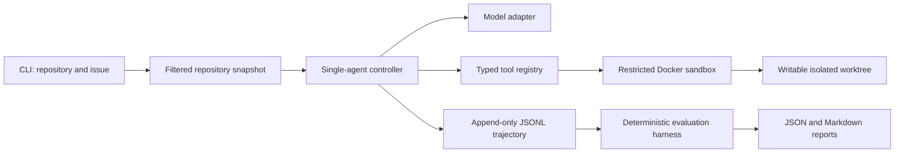

# RepoPilot

RepoPilot is a deliberately small repository coding agent for Python/pytest projects. It accepts a local repository and a natural-language issue, explores and edits a sterile copy through six controlled tools, runs tests in Docker, and records an evaluation-ready trajectory.

This project focuses on autonomous repository exploration, code modification, sandboxed execution, and measurable behavior. It intentionally does not include RAG, long-term memory, a UI, multi-agent orchestration, a database, cloud deployment, or SWE-bench integration.

## Architecture



The architecture separates five concerns:

- `agent`: the inspect → locate → plan → edit → test → revise loop
- `tools`: `list_files`, `search_code`, `read_file`, `apply_patch`, `run_tests`, and `git_diff`
- `sandbox`: staging, path policy, command policy, and Docker execution
- `trajectory`: structured model turns, tool calls, observations, timing, and token usage
- `evaluation`: isolated fixtures, hidden tests, metrics, and reports

The controller independently runs the final tests and captures the final diff. A model's claim that work succeeded is never treated as evidence.

## Execution boundary

RepoPilot does not mount the supplied repository into Docker. It copies regular files to a new run directory, excluding `.git`, environment files, common credential directories, caches, and bytecode. Symbolic links are rejected in the MVP.

The container receives only the copied worktree and runs with:

- no network
- a non-root user
- a read-only root filesystem
- dropped Linux capabilities and `no-new-privileges`
- CPU, memory, process, and command-time limits
- no Docker socket, host home, SSH agent, or inherited credentials

The model cannot provide Docker arguments or shell commands. The only executable repository command is exactly `python -m pytest -q`. Paths are repository-relative and are resolved again inside the container. Tests can execute arbitrary repository code, but only within this boundary.

Docker reduces exposure but is not a virtual-machine security boundary. Do not use the MVP to execute deliberately hostile code on a sensitive Docker host.

## Setup

Requirements:

- Python 3.11 or newer
- Docker with a running daemon
- `uv`, or another installer that understands `pyproject.toml`

```bash
uv sync --extra dev
uv run pytest
```

The first sandboxed run builds `repopilot-sandbox:0.1.0` from the included Dockerfile.

## Run against a repository

Set `OPENAI_API_KEY` only in the host environment. RepoPilot never forwards it to Docker.

```bash
uv run repopilot run /absolute/path/to/python-repository \
  --issue "Describe the bug and expected behavior" \
  --model gpt-5 \
  --output /absolute/path/outside-the-repository/repopilot-runs
```

The output directory contains the isolated worktree, `trajectory.jsonl`, and `run.json`. It must be outside the input repository; if omitted, RepoPilot uses the system temporary directory. The input repository is not modified.

## Deterministic benchmark

```bash
uv run repopilot eval \
  --benchmarks benchmarks/cases \
  --output reports \
  --model scripted
```

The four fixtures cover an arithmetic edge case, configuration precedence, retry semantics, and whitespace normalization. The scripted adapter is not an intelligence benchmark: it deterministically regression-tests the agent loop, tool boundary, patching, Docker execution, trajectory capture, hidden-test injection, metrics, and report generation. Live-model runs use the same harness but can vary between runs.

Hidden tests and solution scripts are outside each agent worktree. Hidden tests are copied into a fresh evaluation sandbox only after the agent has stopped.

Reports include:

- public and hidden task success
- pytest pass/fail/error counts
- changed-file localization precision, recall, and F1
- total and conservatively unnecessary tool calls
- model iterations and repair cycles
- total latency
- provider-reported input, output, cached, and reasoning tokens when available

An unnecessary call is conservatively defined as an exact repeat against an unchanged revision, an invalid or rejected call, a no-op patch, or continued tool use after the first observed passing test state.

## Reproducibility and scope

The dependency lockfile, fixed pytest command, versioned sandbox image, immutable fixture inputs, content-preserving worktree snapshots, structured trajectories, and scripted regression adapter make the infrastructure repeatable. Live LLM output is recorded but is not claimed to be bit-for-bit deterministic.

The MVP supports Python/pytest only. Adding another language requires a separately reviewed image and command profile rather than widening the existing allowlist.
