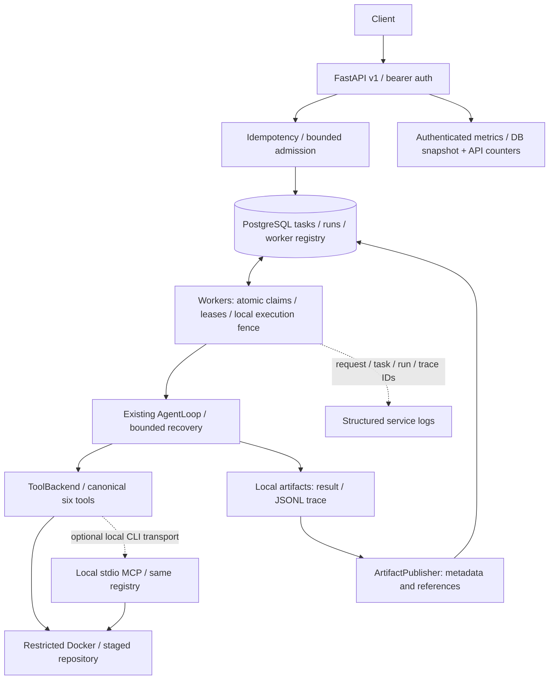
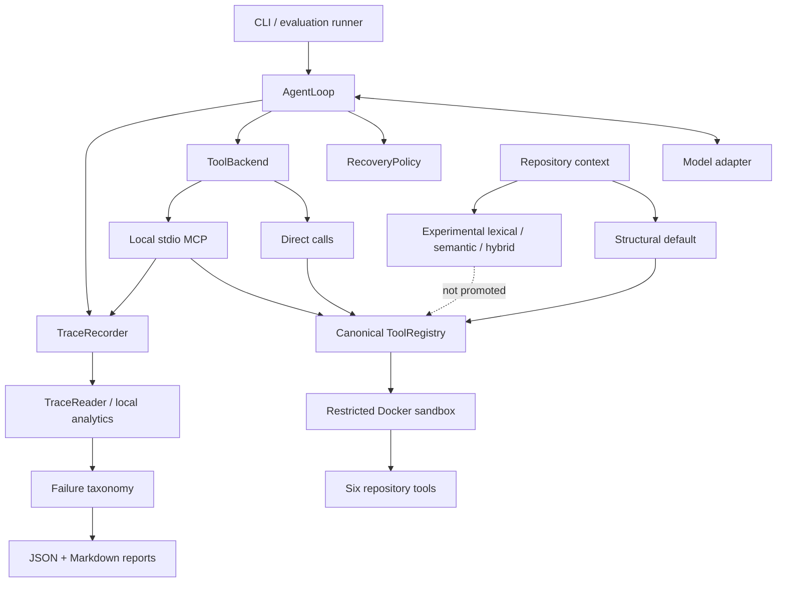

# RepoPilot

RepoPilot is an **end-to-end, production-style service for reliable execution, observation, and evaluation of repository-level coding agents**. It separates long-running agent work from HTTP requests, persists task/run state in PostgreSQL, and runs a bounded AgentLoop with typed tools in restricted Docker sandboxes. The engineering problem is keeping execution ownership, recovery and evidence coherent when clients retry, workers die or tool responses are ambiguous.

**Measured:** 244 regression tests passed; 9,984 scripted service tasks completed with zero duplicate executions across the final scaling cases; a separately frozen SWE-bench Verified pilot resolved 3/5 tasks with official grading. Each result has a different scope—see [service evidence](#measured-service-evidence) and [AI/evaluation evidence](#measured-results).

**Milestone frozen — 2026-09-12.** Single-host execution is the supported boundary. Hosted CI is configured but externally unverified. [Closeout and freeze record](docs/JOB_SEARCH_CLOSEOUT.md) · [Engineering evidence summary](docs/JOB_SEARCH_ENGINEERING_SUMMARY.md) · [Interview map](docs/INTERVIEW_ENGINEERING_MAP.md)

## Engineering highlights

- **Persistent asynchronous execution:** versioned FastAPI endpoints, PostgreSQL task/run lifecycles, explicit Alembic migrations, multiple worker processes and bounded admission with intentional 429 responses.
- **Ownership across failures:** atomic database claims, lease checks and stale-completion fencing combine with shared POSIX execution locks and orphan cleanup. Idempotent submission and execution ownership solve different problems; neither provides exactly-once external effects.
- **Controlled agent recovery:** six typed repository tools, direct/local stdio MCP contract parity, bounded retries, and revision-plus-Git-diff reconciliation when a mutation response is lost.
- **Sandbox policy:** a staged repository, networkless non-root Docker execution and controller-owned test commands keep original repositories, Docker control and model credentials outside the agent sandbox.
- **Observable behavior:** authenticated Prometheus-format service metrics, structured request/task/run logs and correlated agent trace IDs; local artifact publication remains separate from execution staging.
- **Evidence-driven design:** deterministic concurrency, contention, crash/restart and recovery tests; measured PostgreSQL tuning with negative results preserved; frozen retrieval, compatibility and SWE-bench evaluation gates.

## Complete system architecture



The service calls the internal `run_agent` entry point using the normal direct tool path; it does not invoke a second agent implementation or route service work through remote MCP. PostgreSQL holds metadata, while the shared filesystem holds staging, execution locks and full traces. The API exposes result/trace metadata rather than a client-selected file download path.

## Measured service evidence

| Evidence | Exact result | Scope |
|---|---|---|
| Full deterministic regression | **244 passed; 0 failed/errors/skipped; 1 dependency warning** | Core, CLI, MCP, Docker and real PostgreSQL service tests; [latest closeout run](docs/JOB_SEARCH_CLOSEOUT.md) |
| Final scaling cases | **9,984 logical tasks / 19,968 HTTP submissions; 0 failures, rejected admissions or duplicate executions** | 12 local scripted cases: 16/32/64 workers, 32 submitters, two repetitions, 100 ms and one-second execution |
| Interruption checks | **12/12 passed; 0 simultaneous duplicates** | SIGTERM, SIGKILL, pause/stale owner, DB restart, API restart and row contention, each exercised twice |
| Connection saturation follow-up | **100 → 73 peak sampled connections; 63 → 0 connection-limit rejections** | Comparable 64-worker, one-second workload; one connection per worker |
| Real Compose checks | Smoke, four restart assertions and SIGKILL/orphan cleanup passed | Scripted AgentLoop and real Docker execution; migration through revision 0003 |

The comparable **100 ms** workload used 1,536 tasks per case. Throughput below gives both repetitions in tasks/second:

| Workers | Before | Final |
|---:|---:|---:|
| 16 | 112.854 / 113.478 | 110.835 / 114.438 |
| 32 | 232.688 / 230.443 | 236.145 / 218.186 |
| 64 | 280.270 / 262.687 | 262.339 / 268.431 |

**The final DB/admission changes did not produce a general throughput improvement.** The initial admission implementation was slower still, and that evidence remains preserved. Connection pressure and large active-lease dispatch scans improved, while contention and diminishing returns remain. These short runs on a 12-CPU local Docker environment establish neither universal worker limits nor model-serving capacity. The bounded PostgreSQL design remains appropriate for the tested scope; the experiment did not demonstrate a need for a dedicated broker.

[Exact p50/p95 timings, one-second comparison, query plans and limitations](docs/SERVICE_DEPTH.md) · [Preserved earlier stress evidence](docs/SERVICE_STRESS.md) · [Correctness audit](docs/SERVICE_AUDIT.md)

## Quick start

### Service mode — scripted local Compose stack

Requirements: a POSIX host, Docker Engine/Desktop with Compose, Python 3 and a trusted Docker daemon. Run from the repository root:

```bash
./scripts/service-dev.sh
python3 scripts/service-smoke.py
```

On first use, the script creates a private, ignored `.service.env` with generated credentials and an example repository under `~/.local/share/repopilot-service`. It builds the sandbox/control images, migrates PostgreSQL, and starts the API plus two workers. Existing configuration is reused; the smoke command requires `REPOPILOT_SCRIPTED=1` and makes no paid model calls. API/docs are at `http://127.0.0.1:8000/docs`; task and metrics requests require the generated bearer token. The smoke script loads it without printing it.

Workers are trusted controllers with Docker-daemon access and, in provider mode, model credentials. **The Docker socket must never enter the restricted agent sandbox.** Worker/host artifact paths must match for child bind mounts and shared execution locks. [API examples, configuration and trust boundary](docs/SERVICE.md)

Stop the local stack while retaining PostgreSQL data:

```bash
docker compose --env-file .service.env down
```

### Local CLI mode

Python 3.11+, `uv` and Docker are required. `uv sync --frozen --extra dev` installs the local CLI/evaluation environment. Use `uv run repopilot run` for one repository; provider calls require host-side credentials. [CLI and trace commands](#reproduce) remain separate from service submission.

### Evaluation mode

`uv run repopilot eval --benchmarks benchmarks/cases --output reports/deterministic --model scripted` runs the controlled benchmark without paid model calls. Reliability, retrieval and compatibility workflows are documented in [Reproduce](#reproduce). Historical SWE-bench/model results are frozen evidence, not startup steps or tests to rerun for this milestone.

## Service lifecycle and concurrency

A **Task** stores the client request and durable outcome: `QUEUED → RUNNING → SUCCEEDED | FAILED`. A **Run** represents one attempt: `RUNNING → SUCCEEDED | FAILED | ABANDONED`. Recovery abandons an expired attempt and creates another while the task stays RUNNING; finite attempt exhaustion ends the task as FAILED. Database uniqueness, foreign keys and transition guards protect these relationships. No cancellation or arbitrary state-update endpoint exists.

`POST /v1/tasks` commits a task and returns 202 without waiting for agent execution. Matching idempotency keys replay the original task (200); conflicting payloads return 409. The default 4,096 QUEUED/RUNNING admission cap returns 429 for new work at capacity, while replays still work. Every API replica must use the same capacity configuration; trusted direct SQL administration can bypass admission policy.

Workers use short `FOR UPDATE SKIP LOCKED` transactions, probing expired runs before FIFO queued tasks, and commit before agent work. A lease represents time-limited ownership according to the database clock; expiry alone does not prove the old process stopped. A shared per-task `flock`, retained by surviving Docker supervisors, blocks replacement execution until the owner is gone. Cleanup must confirm orphan removal before retry. Heartbeats and completion require the current owner and an unexpired lease; stale completion cannot overwrite a replacement.

Submission idempotency prevents duplicate task creation. Claims, execution locks and completion checks protect execution ownership on the supported host. Recovery can execute another attempt and repeat a provider call: **no exactly-once execution or external-side-effect guarantee is claimed**. A paused owner can reduce availability; safety depends on the shared filesystem/daemon boundary, not PostgreSQL leases alone.

## Two layers of reliability

| Layer | Responsibility | Boundary |
|---|---|---|
| Service | Submission, persistence, admission, claims, leases, ownership, restart/recovery and draining | Task/run lifecycle across API and worker processes |
| Agent | Provider/tool failures, bounded retry, ambiguous mutation reconciliation, workspace revisions and sandbox policy | One controlled attempt inside the existing AgentLoop |

Representative verified failures:

| Failure | Protection / recovery | Evidence |
|---|---|---|
| Duplicate submissions / competing claims | Unique idempotency hash, atomic claim and one active run per task | [Real-process races](tests/service/test_service.py) |
| Expired lease with live or paused owner | Shared execution lock blocks replacement; stale heartbeat/completion rejected | [Lease tests](tests/service/test_service.py), [pause experiment](docs/SERVICE_DEPTH.md#interruption-and-contention-checks) |
| Worker SIGKILL / orphan container | Surviving supervisor retains lock; bounded cleanup precedes retry | [Docker audit tests](tests/service/test_audit.py), [Compose crash check](scripts/service-crash-check.py) |
| API / PostgreSQL restart | Persisted requests/results survive; DB outage fences completion and permits recovery after restoration | [Restart check](scripts/service-restart-check.py), [stress evidence](docs/SERVICE_DEPTH.md) |
| Graceful stop / locked candidate | Stop future claims, drain claimed work; SKIP LOCKED lets independent tasks proceed | [Drain tests](tests/service/test_depth.py), [contention tests](tests/service/test_service.py) |
| Lost mutation response | Inspect workspace revision and Git diff; do not blindly repeat the edit | [Reliability matrix](tests/regression/test_reliability_evaluation.py) |
| Provider / safe-read tool failure | Classify retryability and execution state; bounded retry or explicit stop | [Recovery policy tests](tests/unit/test_recovery_policy.py) |

## Security and sandbox boundary

RepoPilot stages regular files into a separate run directory; it does not mount or modify the original repository. The agent sandbox uses:

- network mode `none`;
- a non-root UID/GID and read-only container root filesystem;
- one staged writable repository mount;
- all Linux capabilities dropped and `no-new-privileges`;
- CPU, memory, PID, command-timeout, and controller-deadline bounds;
- no Docker socket, host home, SSH agent, or forwarded API credentials;
- host- and container-side path checks, patch validation, and protected-test policy;
- immutable controller-owned test plans for qualified SWE-bench environments.

The integration suite inspects the live container configuration. This is defense in depth, not a claim that Docker is a VM-grade security boundary; repository tests still execute arbitrary code inside the container.

## Service observability and CI

Authenticated `/metrics` exposes Prometheus text for task/run states, worker liveness/draining, stale recovery, retained wait/run timings, claim transaction timing, admission outcomes and API pool/HTTP observations. Labels are finite; identifiers belong in logs/traces. Database gauges describe retained history and repeat across API replicas; do not sum those replicas. API counters reset on process restart, and scrape-time aggregation can become expensive. [Metric semantics](docs/SERVICE_DEPTH.md#metrics-interpretation)

Structured service logs link request, task, run and trace identifiers. `ArtifactPublisher` currently has only a local metadata/reference implementation. It does not remove the shared filesystem or provide object storage. Detailed agent traces remain described below.

[GitHub Actions](.github/workflows/tests.yml) configures frozen dependencies, PostgreSQL, Docker regression tests and Compose smoke/restart/crash checks. **Hosted execution remains externally unverified:** the branch push was rejected because the available token lacked `workflow` scope. Local passes are not hosted CI passes. No repeated push attempt is needed with unchanged credentials.

## Agent and evaluation architecture



The sandbox and canonical registry remain authoritative on both direct and MCP paths. MCP changes transport, not permissions. Semantic and hybrid retrieval exist for offline comparison but are not the default.

## Agent execution loop

The controller runs an inspect → locate → plan → edit → test → recover → finalize cycle. The model proposes structured actions; the controller validates them, dispatches tools, tracks workspace revisions and budgets, records evidence, and independently collects the final test result and diff.

Recovery is policy-driven rather than an unrestricted retry loop. Default controller limits include 30 model iterations, three edit/test repair cycles, bounded tool timeouts, bounded observations and patches, and a five-minute soft total deadline. A model’s textual success claim is never treated as test evidence.

## Six controlled tools

| Tool | Capability | Main controls |
|---|---|---|
| `list_files` | Enumerate files and return bounded repository context | Relative paths; file, symbol, and character limits |
| `search_code` | Literal or regex search | Query, match, output, and file-size limits |
| `read_file` | Read numbered line ranges | Workspace resolution and line limits |
| `apply_patch` | Apply a validated patch | Path and size validation; protected tests; no symlink or rename patches |
| `run_tests` | Run the controller-approved pytest command | Fixed argv policy and timeout; no model-selected shell command |
| `git_diff` | Return changed files and a bounded diff | Fixed Git argv and bounded output |

Schemas, descriptions, validation rules, mutation metadata, and normalized results come from one canonical catalog. Direct providers and MCP expose the same six definitions. The model never receives arbitrary shell access, and `run_tests` remains controller- or policy-owned.

## MCP interoperability

`repopilot mcp-serve` implements a local stdio MCP server over the existing registry and sandbox. It exposes exactly the six public tools above. Lifecycle helpers, raw Docker operations, arbitrary filesystem access, and model-selected test commands are not exposed.

Contract tests verify direct/MCP schema parity and normalized success, error, and revision semantics. One controlled end-to-end task passed through the MCP adapter with the same final diff, public result, hidden result, final revision, six calls, and zero unnecessary calls as the direct path. The earlier README reported **0.069 ms median** and **0.108 ms p95** for a 100-call fake-backend adapter microbenchmark. Its raw timing artifact is not retained in the tracked checkpoints, so these historical figures are not independently revalidated here. The current [adapter regression](tests/unit/test_mcp_adapter.py) checks a 100-call median below 10 ms; both measurements exclude model, Docker and sandbox execution time.

RepoPilot does not implement remote MCP transport, production MCP deployment, or arbitrary third-party MCP tool installation.

## Observability and traces

Each run writes an append-only `trajectory.jsonl` plus a reconciled `run.json`. The V2 event envelope includes:

- schema, run, trace, event, span, and parent-span identifiers;
- model, tool, controller, run, and evaluation phases;
- normalized status and structured error metadata;
- iteration, duration, workspace revision before/after, and event origin;
- provider-reported input, output, cached, and reasoning tokens when available;
- final status, stop reason, changed files, and test state.

The streaming reader validates V2 events and normalizes historical V1 trajectories. Local analytics derive tool counts, model/tool latency, token usage, workspace revisions, final state, and stop reason, then reconcile them with `run.json`. `trace-summary` emits deterministic JSON and Markdown. Redaction covers credential-shaped keys and common secret patterns before artifacts are written.

This is local structured observability, not distributed tracing or OpenTelemetry.

## Evaluation profiles and failure taxonomy

Evaluation profiles are versioned, data-only JSON. Defaults resolve before execution; unknown fields and invalid values fail before sandbox startup. Reports record the profile identity, resolved configuration, and content hash.

The versioned taxonomy covers setup, model, tool, policy, retrieval, edit, test, controller, and evaluation/harness failures. A result may retain multiple simultaneous labels. Each classification records phase, observable signal, recoverability, outcome impact, attribution confidence, and evidence event IDs.

The evidence model keeps four concepts separate:

- **observable fact:** something directly present in a trace or report;
- **deterministic classification:** a reproducible rule over trace evidence;
- **benchmark-oracle classification:** a conclusion requiring hidden/reference data;
- **manual hypothesis:** a possible explanation that is not treated as fact.

Validated controlled runs produced zero false task-failure labels and zero unclassified structured errors. That is scoped evidence for the frozen fixtures and rules, not a promise of complete classification for arbitrary future failures.

## Reliability and recovery

Recovery decisions use operation class, retryability, execution state, remaining deadline, retry budget, and workspace revision. The policy distinguishes:

- a bounded retry for a known pre-execution safe-read failure;
- returning rejected or invalid actions to the model without automatic replay;
- bounded provider retry only for retryable pre-execution failures;
- policy-controlled test-timeout handling;
- immediate stop for exhausted or non-recoverable conditions;
- reconciliation rather than replay when a mutation may already have executed.

The ambiguous mutation case is the central state-safety example:

```text
apply_patch may have executed, but its response was lost
    → do not replay the mutation
    → inspect workspace revision and git_diff
    → confirm repository state
    → continue without a duplicate edit
```

The frozen deterministic reliability matrix passed **8/8 expected scenarios**: **6/6 declared recoverable scenarios recovered**, and **2/2 declared non-recoverable scenarios stopped as expected**. Unsafe retries, duplicate mutations, revision divergence, budget overshoots, and unclassified errors were all zero. This establishes behavior only for the injected scenarios; it is not a production reliability or availability claim.

## Repository context and retrieval experiment

The default `list_files` context is an issue-ranked Python AST map containing modules, imports, classes, functions, methods, signatures, source/test roles, and line numbers. It is bounded and deterministic; `search_code` and `read_file` remain available for exact evidence.

RepoPilot also implements lexical retrieval, local semantic retrieval, and hybrid rank fusion. Embeddings use a bounded ephemeral cache; there is no vector database, persistent retrieval service, or remote embedding API.

The frozen eight-case offline comparison produced:

| Strategy | R@1 | R@3 | R@5 | MRR |
|---|---:|---:|---:|---:|
| Structural | 0.375 | 0.625 | 1.000 | 0.573 |
| Semantic | 0.375 | 0.750 | 1.000 | 0.604 |
| Hybrid | 0.375 | 0.625 | 1.000 | 0.594 |

Semantic retrieval improved MRR and uniquely recovered one predeclared paraphrase case at R@3. Promotion required two unique recoveries. The Phase 6 gate therefore **failed**: no live structural-versus-hybrid comparison ran, no held-out tuning followed the result, and structural retrieval remained the default. The negative result is preserved in [P1_CHECKPOINT.json](docs/checkpoints/P1_CHECKPOINT.json).

## SWE-bench Verified integration

RepoPilot keeps real-world evidence in separate tracks because they answer different questions.

### Reference integrity

Five pinned SWE-bench Verified definitions passed **5/5** checkout and reference/test-patch integrity validation. This verifies benchmark plumbing and immutable revisions, not agent behavior or task resolution.

### First feasibility cohort

Three instances were frozen before qualification. Flask and pytest passed gold, security, contamination, trusted-plan, and six-tool checks; a Requests instance failed the official gold/environment gate. Result: **2/3 feasible**. No failed instance was replaced.

### First behavioral pilot

Two authorized instances received exactly one frozen `mistral:7b` attempt each. Result: **0/2 resolved**, with two empty predictions. The model emitted plan-only behavior and made **zero model-originated tool calls**; four recorded calls were controller-owned final test/diff collection. There were no reruns, substitutions, or post-result tuning. This diagnosed a tool-initiation incompatibility; two tasks are not a meaningful estimate of general coding ability.

This remains useful historical development evidence, but it is superseded as RepoPilot's latest external behavioral evidence by the fresh DeepSeek Cohort 2 pilot below.

### Fresh DeepSeek cohort qualification

A new three-task cohort was selected from ten unused candidates before environment testing. Official gold grading passed **3/3**, and security and contamination gates passed. The frozen qualification result was **1/3 — STOP PILOT**:

- pytest was rejected because the frozen test plan encountered warning-policy failure behavior;
- Requests was rejected because its frozen suite required httpbin/network access;
- Matplotlib qualified.

The failed tasks were not replaced or retuned. **DeepSeek was not run.** Details are in the [qualification checkpoint](docs/checkpoints/DEEPSEEK_SWEBENCH_COHORT_QUALIFICATION.md).

### Fresh Cohort 2 qualification and behavioral pilot

Cohort 2 began with a fresh, frozen pool of 17 unused SWE-bench Verified instances across nine repository families. A uniform environment-only pre-screen considered pinned image availability, exact-base reproducibility, local image size, and whether one of at most five hash-ranked tracked test files passed under the unchanged networkless sandbox. It did not use gold patches, expected-fix metadata, difficulty labels, prior model outcomes, or solve-likelihood judgments. **7/17** instances were eligible.

Five instances were then selected by a frozen deterministic hash ordering, with at most two from one repository family. All five passed exact-base staging, trusted test plans, the six-tool environment smoke, security and contamination gates, and official gold sanity: **5/5 qualified and 5/5 gold-resolved**. No failed candidate was substituted and the cohort was frozen before DeepSeek ran.

Each qualified instance received exactly one `deepseek-v4-pro` attempt under the unchanged prompt, six tools, structural retrieval, 30-iteration controller budget, recovery policy, sandbox, and official SWE-bench harness. There were no reruns, substitutions, post-hoc tuning, or manual patch repairs.

| Frozen instance | Official result | F2P | P2P | Controller outcome |
|---|---|---:|---:|---|
| `mwaskom__seaborn-3187` | Unresolved; empty patch | unavailable | unavailable | `iteration_limit` |
| `pydata__xarray-6938` | Unresolved; empty patch | unavailable | unavailable | `iteration_limit` |
| `pylint-dev__pylint-7277` | **Resolved** | 1/1 | 122/122 | `tests_passed` |
| `sphinx-doc__sphinx-8551` | **Resolved** | 1/1 | 32/32 | `tests_passed` |
| `sphinx-doc__sphinx-9230` | **Resolved** | 1/1 | 44/44 | `tests_passed` |

**RepoPilot resolved 3/5 tasks in a frozen five-instance SWE-bench Verified behavioral pilot with official grading.** Both unresolved attempts exhausted the frozen 30-iteration budget and produced empty patches. The evidence supports those observable facts; it does not support a stronger root-cause claim. Empty predictions provide no patch for the official harness to execute, so their F2P/P2P counts are unavailable rather than inferred.

This five-task pilot is external behavioral evidence, not an estimate of broad SWE-bench Verified performance. It is not a 60% general solve-rate claim, a leaderboard comparison, or production-readiness evidence. The frozen [qualification](docs/checkpoints/DEEPSEEK_SWEBENCH_COHORT2_QUALIFICATION.md) and [behavioral report](docs/checkpoints/DEEPSEEK_SWEBENCH_COHORT2_BEHAVIORAL.md) preserve the full protocol and limitations.

RepoPilot therefore demonstrates SWE-bench reference validation, selective environment qualification, security/contamination gating, prediction export, official grading integration, and frozen one-shot behavioral evaluation. Broad SWE-bench performance is not established.

## Model/controller compatibility

The first behavioral pilot showed that a valid environment and nominal tool-capable endpoint do not guarantee that a model will operate the controller protocol. RepoPilot therefore added a frozen 12-case gate covering tool initiation, action validity, sequencing, observation handling, correction, state awareness, and finalization.

| Frozen gate | `mistral:7b` | `deepseek-v4-pro` |
|---|---:|---:|
| Strict decision | **NOT COMPATIBLE** | **NOT COMPATIBLE** |
| First valid tool-call rate | 0% | 100% |
| Protocol-complete rate | 0/12 | 9/12 (75%) |
| Plan-only loop rate | 83.3% | 0% |
| Successful finalization | 2/12 | 12/12 |

Mistral produced 43 plan actions, two final actions, and zero model tool calls; the plan-only behavior reproduced outside SWE-bench. DeepSeek initiated tools in every tool-required case and had no plan-only loops, but missed three exact sequence-conformance requirements. The predeclared strict threshold was at least 80%, so its permanent strict verdict remains **NOT COMPATIBLE**.

A separately frozen evidence review classified DeepSeek’s three misses as non-safety-critical for a tightly bounded pilot and returned **ADMITTED FOR SMALL BEHAVIORAL PILOT**. That is a distinct decision, not an adjusted threshold or compatibility pass. The first fresh cohort then failed qualification and stopped before execution; the independently selected Cohort 2 later qualified 5/5 and produced the separately reported 3/5 behavioral result. Neither event revises the strict 9/12 verdict.

These gates measure compatibility with RepoPilot’s protocol, not general model quality or software-engineering intelligence.

## Measured results

| Track | Measured result | What it establishes | What it does not establish |
|---|---|---|---|
| Controlled deterministic benchmark | 12/12 task, public, and hidden success; localization F1 1.00; 72 calls; 0 unnecessary | Controller, tools, sandbox, traces, hidden scoring, and reports | Model intelligence |
| Historical controlled DeepSeek coding report | Earlier README: 12/12 task/public/hidden; F1 1.00; 80 calls, 1 unnecessary | Historical report of one small synthetic live-model run; raw run artifact not located in tracked checkpoints | Independently revalidated closeout evidence, strict compatibility or broad coding performance |
| MCP parity/security | 23 selected tests passed in the P0 checkpoint; direct/MCP parity reruns in regression; historical 0.069 ms median reported above | Local stdio contract and behavior parity; raw historical timing is not retained | Revalidated exact historical timing, remote or production MCP deployment |
| Reliability matrix | 8/8 scenarios; 6/6 recoverable; all unsafe-state counters zero | Frozen injected recovery behavior | Availability under arbitrary failures |
| Retrieval experiment | Semantic MRR 0.604 vs structural 0.573; promotion gate failed | Reproducible offline comparison and negative-result discipline | Live task improvement |
| SWE-bench reference integrity | 5/5 | Pinned checkout and reference/test-patch applicability | Agent solves |
| First SWE-bench feasibility | 2/3 | Two sandbox-compatible environments | General environment coverage |
| First SWE-bench behavioral pilot | 0/2; empty predictions; zero model tool calls | Diagnosed Mistral tool-initiation failure | Meaningful coding-capability estimate |
| Mistral compatibility | NOT COMPATIBLE; 0/12 protocol complete | Protocol mismatch under the frozen gate | General model ranking |
| DeepSeek strict compatibility | **NOT COMPATIBLE; 9/12 (75%), threshold ≥80%** | Stronger tool use but failed exact frozen threshold | A compatibility pass |
| DeepSeek behavioral admission | ADMITTED FOR SMALL BEHAVIORAL PILOT | No safety/reliability-critical deviation in reviewed evidence | SWE-bench success |
| Earlier fresh DeepSeek cohort | Gold 3/3; qualification 1/3; **STOP PILOT** | Qualification gates correctly blocked execution | DeepSeek behavioral SWE-bench evidence |
| Fresh Cohort 2 qualification | **5/5 qualified; 5/5 official gold sanity** from a frozen 17-instance pool with 7/17 pre-screen eligible | Five reproducible, security-gated environments selected without solve evidence | Agent task success or general environment coverage |
| Fresh Cohort 2 behavioral | **3/5 officially resolved**; one attempt per task; no reruns, substitutions, tuning, or manual repair | External one-shot behavioral evidence on this frozen subset | A 60% general solve rate, leaderboard comparability, or production readiness |

The deterministic and live-model success rates are intentionally not merged. The old controlled DeepSeek result and exact MCP timings are retained as historical README reports, not promoted to independently verified closeout evidence. The [P0 checkpoint](docs/checkpoints/P0_CHECKPOINT.json) supports the deterministic, reliability and 23-test MCP results; the frozen Cohort 2 links above retain official behavioral artifacts.

## Reproduce

Requirements: Python 3.11+, Docker with a running daemon, and `uv`.

```bash
uv sync --frozen --extra dev --extra service
# Configure a dedicated disposable PostgreSQL database as described below.
uv run --frozen --extra dev --extra service pytest
```

The complete suite requires Docker and `REPOPILOT_TEST_DATABASE_URL` pointing to a
**disposable PostgreSQL database**; the fixture truncates service tables. Without
that URL, service tests skip. Follow the [database setup and full-suite instructions](docs/SERVICE.md#host-development-and-tests)
to reproduce the no-skip result. Never use the demo or a database containing retained tasks.

Run the deterministic controlled benchmark:

```bash
uv run repopilot eval \
  --benchmarks benchmarks/cases \
  --output reports/deterministic \
  --model scripted
```

Run RepoPilot on a local Python/pytest repository. Credentials remain in the host process and are not forwarded into Docker:

```bash
export OPENAI_API_KEY="your-host-only-value"
uv run repopilot run /absolute/path/to/repository \
  --issue "Describe the bug and expected behavior" \
  --provider openai \
  --model YOUR_MODEL \
  --output /absolute/path/outside-the-repository/repopilot-runs
```

Validate and summarize a V1 or V2 trace:

```bash
uv run repopilot trace-summary /absolute/path/to/trajectory.jsonl \
  --output reports/trace-summary
```

Serve the six tools over local stdio MCP:

```bash
uv run repopilot mcp-serve /absolute/path/to/repository \
  --issue "Describe the task" \
  --output /absolute/path/outside-the-repository/mcp-runs
```

Run the deterministic reliability matrix and offline retrieval comparison:

```bash
uv run repopilot reliability --output reports/reliability

uv run repopilot retrieval-eval \
  --strategies structural lexical semantic hybrid \
  --output reports/retrieval
```

Validate the five pinned real-world definitions. This uses network access for public checkout and validates reference integrity; it is not a behavioral SWE-bench run:

```bash
uv run repopilot real-validate \
  --tasks benchmarks/real_world \
  --output reports/real-world-reference
```

Run the frozen local model/controller compatibility profile:

```bash
uv run python -m repopilot.evaluation.model_compatibility \
  --profile configs/evaluation/model_compatibility.json \
  --output reports/model-compatibility
```

The compatibility command is a synthetic protocol gate, not a coding benchmark. The frozen SWE-bench behavioral pilots are preserved checkpoint workflows rather than a general-purpose CLI benchmark command.

## Design trade-offs and limitations

- Active admission is bounded, but per-tenant quotas, disk/history retention, backup drills and TLS termination are not implemented. Authentication is one shared trusted principal.
- At higher scale, admission serialization, connection budget, polling and metrics aggregation need workload-specific measurement; multi-host operation requires redesigned execution fencing. No broker, orchestration or object-storage deployment was added.

- RepoPilot now includes a single-host execution service around its single-agent Python/pytest runtime; it makes no production-readiness or availability claim.
- The service uses PostgreSQL and multiple local worker processes. It has no multi-host execution, persistent agent memory, UI, Kubernetes layer, or production deployment claim.
- MCP is local stdio only; the direct path remains the normal internal controller path.
- Structural retrieval remains the default. Semantic/hybrid retrieval was implemented but failed its promotion gate.
- The controlled benchmark is small and scripted evaluation validates infrastructure, not intelligence.
- Agent recovery evidence covers eight frozen injected scenarios; service lifecycle/concurrency evidence and corrected crash-path findings are reported separately in [SERVICE_AUDIT.md](docs/SERVICE_AUDIT.md).
- External behavioral evidence now exists: RepoPilot resolved 3/5 tasks in the frozen Cohort 2 pilot under official grading, but five tasks and one attempt each provide no variance estimate or broad solve-rate evidence.
- Two Cohort 2 attempts exhausted the frozen 30-iteration budget without editing and produced empty patches; no unsupported root cause is inferred.
- SWE-bench environment compatibility remains selective under the strict networkless sandbox and trusted-plan boundary: an earlier fresh cohort stopped at 1/3 qualification even though Cohort 2 later qualified 5/5.
- The first behavioral pilot remains historical evidence: it resolved 0/2 because the frozen local Mistral model did not initiate tools, and it is superseded as the latest behavioral result by Cohort 2.
- DeepSeek's strict compatibility verdict remains **NOT COMPATIBLE at 9/12**. Its separate behavioral-admission decision remains **ADMITTED FOR SMALL BEHAVIORAL PILOT**; neither decision is retroactively changed by the 3/5 result.
- Synchronous provider calls can finish after the soft controller deadline when already in flight. RepoPilot does not claim hard cancellation.
- Local embeddings use an ephemeral bounded cache; there is no vector database or remote embedding service.
- Docker isolation is not equivalent to a VM-grade security boundary.

## Project scope and non-goals

The current milestone deliberately excludes multi-agent orchestration, persistent agent memory, arbitrary shell access, remote MCP, dashboards, broad language support, multi-host infrastructure, Kubernetes, and a UI. The PostgreSQL-backed service is documented in [SERVICE.md](docs/SERVICE.md). Future ideas in [V2_SPEC.md](docs/V2_SPEC.md) are design context only; the claims above describe only implemented and measured behavior.

Historical evaluation protocols, negative results, and stopped gates are retained as engineering evidence. The new service tests do not revise or generalize those benchmark outcomes.
