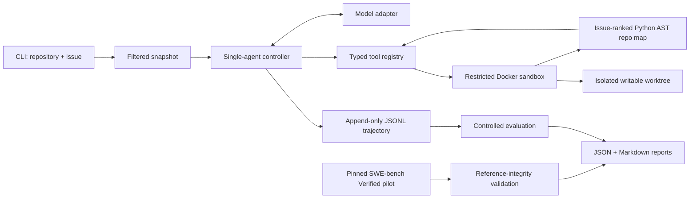

# RepoPilot

RepoPilot is an evaluated coding agent that takes a local Python repository plus a natural-language issue, explores the codebase, applies a patch, runs pytest inside a restricted Docker container, repairs failures, and returns an auditable diff.

The project is intentionally narrow: one capable agent, six controlled tools, one sandbox boundary, and a small hidden-test benchmark. It demonstrates repository-level agent engineering without adding RAG, memory, a UI, multi-agent orchestration, a database, or deployment infrastructure.

## What it demonstrates

- A real tool-calling loop: **inspect → structurally locate → plan → edit → test → repair → final diff**
- A bounded, issue-ranked Python AST repository map for modules, imports, classes, functions, methods, and signatures
- Repository tools with typed inputs instead of arbitrary shell access
- Docker isolation for repository reads, writes, patching, Git inspection, and test execution
- Append-only JSONL trajectories with actions, observations, timing, and token usage
- Deterministic infrastructure regression plus separate live-model evaluation
- Hidden-test scoring and behavior metrics beyond a pass/fail demo

## Architecture



The model decides what to inspect and change. The controller owns budgets, tool dispatch, trajectory recording, the final test run, and the final diff. A model's claim that a task succeeded is never treated as evidence.

### Agent loop

```text
inspect files
    ↓
use AST map to locate likely modules and symbols
    ↓
search when lexical evidence helps; read exact code
    ↓
state a concise plan
    ↓
apply a unified diff
    ↓
run fixed pytest command
    ├── failure → inspect observation → revise, within repair budget
    └── pass    → inspect final diff → finish
```

Default limits are 30 model iterations, three failed edit/test repair cycles, a 30-second command timeout, a five-minute overall deadline, and bounded observations and patches.

### Repository context

Lexical search alone does not tell the agent whether a match is a module, class, method, test, or import relationship. RepoPilot therefore builds a read-only structural outline whenever `list_files` runs. The implementation uses Python's standard-library `ast` parser inside the sandbox and records:

- module paths and source/test roles
- direct top-level imports
- classes and base expressions
- top-level functions, methods, async functions, signatures, and line numbers

The extractor scans at most 5,000 Python files and parses them deterministically before applying the output budget of 100 files, 300 symbols, and 8,000 characters. Under budget pressure it ranks exact and partial issue-text matches against paths, modules, classes, functions, and methods; adds a small import-neighbor signal; prefers production code on otherwise equal evidence; and ranks relevant symbols within selected files. Stable path and source-order tie breakers make repeated maps reproducible. Small repositories that fit the budget retain traversal and source order.

The map reports truncation and per-file parse failures explicitly. It is an initial localization aid, not a replacement for evidence: the agent uses `read_file` for implementations and can still use literal or regex `search_code` for configuration keys, call sites, error strings, dynamically defined names, and non-Python files. This keeps structural extraction behind the existing typed tool and Docker boundary instead of adding a seventh tool, embeddings, a vector database, or a second agent.

## Controlled tools

| Tool | Capability | Main controls |
|---|---|---|
| `list_files` | Enumerate files and return a bounded Python AST map | Relative paths, file/symbol/character caps, parse-error isolation |
| `search_code` | Literal or regex code search | Query, file-size, and match caps |
| `read_file` | Read numbered line ranges | Workspace resolution, 400-line maximum |
| `apply_patch` | Apply a Git diff or `*** Begin Patch` envelope | Path validation, size cap, protected tests, no symlink/rename patches |
| `run_tests` | Execute repository tests | Exact allowlist: `python -m pytest -q`, timeout |
| `git_diff` | Return changed files and diff | Fixed Git argv, bounded output |

The model cannot provide raw commands, shell syntax, Docker flags, or host paths.

## Docker security boundary

The input repository is never mounted directly. RepoPilot copies regular files into a new run directory, excluding `.git`, environment files, common credential directories, caches, and bytecode. Symbolic links are rejected in this MVP. The original repository is not modified.

The sandbox uses:

- `--network none`
- a non-root user
- a read-only container root filesystem
- one writable mount containing only the copied worktree
- dropped Linux capabilities and `no-new-privileges`
- memory, CPU, process, and timeout limits
- no Docker socket, host home directory, SSH agent, or forwarded API key

Path checks run in both the host policy layer and the container-side runner. The integration test also inspects the running container to verify these settings.

This is defense in depth, not a claim that Docker is a VM-grade boundary. Repository tests execute arbitrary code inside the container, and a container-runtime or kernel vulnerability remains outside RepoPilot's threat model.

## Trajectories

Every run writes `trajectory.jsonl` and a summarized `run.json`. Events include:

- model and run configuration
- iteration and repair-cycle progression
- every tool call and its validated arguments
- observations, structured errors, and workspace revisions
- public test output, exit status, timeout status, and latency
- model/tool latency and total wall-clock latency
- input, output, cached, and reasoning tokens when the provider reports them
- final stop reason, changed files, test state, and success state

### Concise example

The deterministic `arithmetic_edge_case` trajectory is representative:

```text
1  list_files   → AST map locates safe_divide in calculator.py at line 1
2  search_code  → lexical match confirms the safe_divide definition
3  read_file    → denominator <= 0 rejects valid negative values
4  PLAN         → change only the zero check, then test
5  apply_patch  → calculator.py modified; public-test edit ignored by policy
6  run_tests    → 2 public tests passed; controller stops further exploration
   git_diff     → controller records one changed production file
   hidden eval  → negative-denominator test passed
```

## Evaluation methodology

The benchmark contains 12 small, synthetic Python repositories. The original four remain unchanged as a historical baseline:

1. arithmetic edge-case handling
2. configuration precedence
3. retry off-by-one semantics
4. whitespace normalization

Eight harder cases add pagination boundaries, shipping thresholds, falsey feature-flag overrides, validation-pipeline ordering, cache invalidation, atomic reservation rollback, tax-exemption routing, and inherited permission composition. They use flat multi-module and `src/`-layout packages, cross-file behavior, classes, inheritance, and plausible distractors. Their issue text describes symptoms without naming the reference fix file or exact symbol. Every new buggy fixture fails both its public reproducer and hidden suite before repair; corpus tests independently apply each reference patch and require both suites to pass.

Each case contains an issue, an unmodified buggy repository, expected localization metadata, public tests, and hidden tests. The agent sees the issue and staged repository only. Hidden tests and solution scripts stay outside the mounted worktree; hidden tests run in a fresh sandbox after the agent stops.

Two modes serve different purposes:

- **Deterministic regression:** a scripted model drives known tool actions. This validates orchestration, sandboxing, patching, trajectories, metrics, hidden-test injection, and report generation. It is not a measure of model intelligence.
- **Live model:** a configured network provider chooses actions through the same controller. This measures actual end-to-end agent behavior and is saved separately because model output and latency can vary.

Metrics include task success, public and hidden pytest results, changed-file localization precision/recall/F1, total and conservatively unnecessary tool calls, iterations, repair cycles, latency, provider-reported tokens, and stop reason.

An unnecessary call is conservatively defined as an exact repeat against an unchanged revision, an invalid or rejected call, a no-op patch, or non-diff tool use after the first observed passing test state.

### Real-world pilot track

A separate five-task pilot records genuine [SWE-bench Verified](https://huggingface.co/datasets/princeton-nlp/SWE-bench_Verified) instances from Flask, Requests, and pytest. Each definition preserves the upstream repository, immutable base commit, original issue description, gold patch, upstream test patch, FAIL_TO_PASS and PASS_TO_PASS directives, environment-setup commit, difficulty, and defensible changed-file metadata. It does not modify or replace the 12 controlled cases.

`repopilot real-validate` fetches each exact revision into a temporary directory, verifies the resolved commit, checks and applies the gold patch, checks the upstream test patch against that result, and compiles changed Python files. The temporary checkout is removed afterward. Network is required only to acquire the public revision; agent sandbox execution still requires no network.

This lightweight gate is deliberately called **reference integrity**, not behavioral success. It also emits an official-format `gold-predictions.jsonl` so the exact subset can be handed to SWE-bench without translating patches manually. The official SWE-bench harness uses repository- and instance-specific Docker environments and remains the authority for FAIL_TO_PASS/PASS_TO_PASS grading. RepoPilot does not reproduce that large CI matrix internally, and no real-world live-agent task is claimed as solved yet. See the [official harness documentation](https://www.swebench.com/SWE-bench/reference/harness/).

## Model providers

RepoPilot keeps provider construction outside the agent loop. All network backends use the same system prompt, six tools, controller budgets, trajectories, and evaluation code:

- `openai` uses the official OpenAI endpoint and the SDK's normal `OPENAI_API_KEY` handling. It remains the default for backward compatibility.
- `openai_compatible` targets a configurable HTTP(S) API root implementing `/v1/responses` and function tools, such as a compatible local inference server. It never inherits `OPENAI_API_KEY`; use `--api-key-env` only when that endpoint has its own credential.
- `deepseek` uses the official DeepSeek Chat Completions tool-calling API at `https://api.deepseek.com`. It accepts `deepseek-v4-pro` and `deepseek-v4-flash`, reads only `DEEPSEEK_API_KEY`, and uses documented non-thinking tool mode so provider-specific reasoning state does not leak into the agent controller. The adapter translates RepoPilot's neutral history into native assistant tool-call and tool-result messages.

Provider-reported input, output, cached, and reasoning usage is recorded when present. For DeepSeek, `prompt_tokens`, `completion_tokens`, `prompt_cache_hit_tokens`, and reported reasoning tokens map directly to those fields. Missing usage remains JSON `null`; RepoPilot does not estimate token counts. The DeepSeek adapter has been exercised against the official live API; the generic compatible adapter remains validated with fakes only.

## Measured results

### A. Deterministic/reference infrastructure validation

| Track | Scope | Result | What it establishes |
|---|---:|---:|---|
| Controlled deterministic | 12 tasks | 12/12 public and hidden; F1 1.00; 72 calls; 0 unnecessary; 12.58s | Controller, tools, sandbox, patches, hidden evaluation, and reports |
| Ranked-context stress | 252 Python files | relevant module and symbol retained within 8-file/8-symbol/1,500-character caps | Deterministic prioritization under tested budget pressure |

### B. DeepSeek controlled live-agent evaluation

On 2026-08-15, `deepseek-v4-pro` ran against the official `https://api.deepseek.com` Chat Completions endpoint in documented non-thinking tool mode. A one-case `arithmetic_edge_case` smoke run passed public and hidden tests before the unchanged 12-case corpus was run once. The full run achieved 12/12 task, public-test, and hidden-test success with mean localization precision, recall, and F1 of 1.00. It used 80 tool calls, including one rejected patch call, 68 model/controller iterations, no failed-test repair cycles, and 139.32 seconds of summed per-task latency. Every task stopped with `tests_passed`.

| Case | Task/public/hidden | Loc. P/R/F1 | Calls (unnecessary) | Iterations | Repairs | Latency s | Input/cached/output tokens |
|---|---:|---:|---:|---:|---:|---:|---:|
| arithmetic_edge_case | pass/pass/pass | 1.00/1.00/1.00 | 5 (0) | 4 | 0 | 9.21 | 4,658/3,968/237 |
| config_precedence | pass/pass/pass | 1.00/1.00/1.00 | 6 (0) | 5 | 0 | 8.97 | 6,651/5,632/357 |
| inherited_permission_union | pass/pass/pass | 1.00/1.00/1.00 | 6 (0) | 5 | 0 | 10.90 | 7,880/6,400/501 |
| layered_feature_flags | pass/pass/pass | 1.00/1.00/1.00 | 7 (0) | 6 | 0 | 12.52 | 9,375/7,808/543 |
| pagination_exact_multiple | pass/pass/pass | 1.00/1.00/1.00 | 7 (0) | 6 | 0 | 12.04 | 9,196/7,680/466 |
| reservation_rollback | pass/pass/pass | 1.00/1.00/1.00 | 9 (1) | 8 | 0 | 18.64 | 15,928/13,568/896 |
| retry_off_by_one | pass/pass/pass | 1.00/1.00/1.00 | 6 (0) | 5 | 0 | 8.33 | 6,617/5,504/315 |
| settings_cache_invalidation | pass/pass/pass | 1.00/1.00/1.00 | 7 (0) | 6 | 0 | 11.87 | 10,510/8,704/518 |
| shipping_threshold | pass/pass/pass | 1.00/1.00/1.00 | 5 (0) | 4 | 0 | 7.95 | 5,570/4,480/317 |
| string_normalization | pass/pass/pass | 1.00/1.00/1.00 | 6 (0) | 5 | 0 | 9.25 | 6,258/5,248/322 |
| tax_exemption_routing | pass/pass/pass | 1.00/1.00/1.00 | 7 (0) | 6 | 0 | 13.27 | 9,720/8,192/612 |
| validation_pipeline_order | pass/pass/pass | 1.00/1.00/1.00 | 9 (0) | 8 | 0 | 16.35 | 15,015/12,672/764 |
| **Total/mean** | **12/12/12** | **1.00/1.00/1.00 mean** | **80 (1)** | **5.67 mean** | **0** | **139.32** | **107,378/89,856/5,848** |

Reasoning tokens were not reported and remain `null`. At the official `deepseek-v4-pro` prices visible on the evaluation date—$0.003625/M cache-hit input tokens, $0.435/M cache-miss input tokens, and $0.87/M output tokens—the full run calculates to approximately **$0.01304**. Including the separate smoke run (4,388 input, 2,816 cached, 220 output) gives 111,766 input, 92,672 cached, and 6,068 output tokens and an approximate combined cost of **$0.01392**. This is a calculation from API-reported usage, not an independent billing-ledger measurement.

The only unnecessary call was an initially rejected `reservation_rollback` patch whose quoted context did not match. The unchanged workspace rejected it, the next patch applied cleanly, and both test suites passed. This is recorded as tool-error recovery, not a failed-test repair cycle or a task rerun. The model did not emit the requested `PLAN:` text before editing; this instruction-following limitation did not bypass the controller or affect evaluation scoring.

A historical OpenAI `gpt-5.6-terra` run on the original four-task corpus achieved 4/4 public and hidden success, localization F1 1.00, 24 calls, and zero unnecessary calls. It was measured on 2026-08-15 before the 12-task expansion and is retained only as historical evidence, not as a provider comparison.

### C. Real-world SWE-bench reference/integration validation

| Track | Scope | Result | What it establishes |
|---|---:|---:|---|
| Reference integrity | 5 SWE-bench Verified tasks | 5/5 | Immutable checkout and gold/test-patch applicability; not behavioral success |

The five real-world tasks were not run with the live agent. No SWE-bench Verified task is claimed as solved by DeepSeek or any other live RepoPilot run.

## Reproduce it

Requirements: Python 3.11+, Docker with a running daemon, and `uv`.

```bash
uv sync --extra dev
uv run pytest
```

Run the deterministic benchmark and write isolated reports:

```bash
uv run repopilot eval \
  --benchmarks benchmarks/cases \
  --output reports/deterministic \
  --model scripted
```

Validate the five pinned real-world definitions. This performs public Git checkout and reference-integrity checks, not official SWE-bench behavioral grading:

```bash
uv run repopilot real-validate \
  --tasks benchmarks/real_world \
  --output reports/real-world-reference
```

Run a live evaluation. `OPENAI_API_KEY` remains in the host process and is never forwarded to Docker:

```bash
export OPENAI_API_KEY="..."
uv run repopilot eval \
  --benchmarks benchmarks/cases \
  --output reports/live-gpt-5.6-terra \
  --provider openai \
  --model gpt-5.6-terra
```

Point the same agent at an already-running OpenAI-compatible local endpoint. The model value must match the endpoint's served model name:

```bash
uv run repopilot run /absolute/path/to/repository \
  --issue "Describe the bug and expected behavior" \
  --provider openai_compatible \
  --base-url http://127.0.0.1:8000/v1 \
  --model local-code-model \
  --output /absolute/path/outside-the-repository/repopilot-runs
```

For an authenticated compatible endpoint, export a separate key and add `--api-key-env LOCAL_MODEL_API_KEY`. RepoPilot does not download, launch, or configure the inference server or model weights.

Use the official DeepSeek endpoint independently of OpenAI credentials:

```bash
export DEEPSEEK_API_KEY="..."
uv run repopilot run /absolute/path/to/repository \
  --issue "Describe the bug and expected behavior" \
  --provider deepseek \
  --model deepseek-v4-pro \
  --output /absolute/path/outside-the-repository/repopilot-runs
```

The key is accepted only through `DEEPSEEK_API_KEY`; it is not a CLI value and is not included in model metadata, trajectories, or reports. `deepseek-v4-flash` can be selected by changing only `--model`.

Run against another local Python/pytest repository:

```bash
uv run repopilot run /absolute/path/to/repository \
  --issue "Describe the bug and expected behavior" \
  --model gpt-5.6-terra \
  --output /absolute/path/outside-the-repository/repopilot-runs
```

Output directories contain the isolated worktree, JSONL trajectory, run summary, and JSON/Markdown evaluation reports. Runtime outputs are Git-ignored because they contain machine-specific paths and full repository observations.

## Design trade-offs and limitations

- **Python/pytest only:** one fixed test profile keeps the command boundary understandable. Other languages require separately reviewed images and allowlists.
- **Syntactic repository map:** Python AST extraction requires parseable source, sees imports rather than runtime call graphs, and uses a simple `src`/`lib` module-root convention. Parse errors are isolated and reported; dynamic relationships still require search and reading.
- **Bounded ranked context:** the stress fixture covers 252 Python files, not arbitrarily large monorepositories. Only the first 5,000 Python files are candidates, scoring is lexical/structural rather than semantic, and dynamic relationships still require search and reading.
- **Docker, not a VM:** appropriate for this portfolio benchmark, not for executing deliberately hostile code on a sensitive host.
- **Working-tree snapshots:** `.git` history and repository symlinks are intentionally unavailable to the agent.
- **Protected tests:** autonomous patches cannot modify files under `tests/` or standard Python test filenames. This preserves evaluation integrity but means test-authoring tasks are outside the MVP.
- **Secret handling:** host credentials are excluded and not forwarded, but secrets committed in ordinary source files could still be read and sent to the configured model provider.
- **Small controlled benchmark:** useful for deterministic regression and architecture discussion, but not evidence of broad real-world coding-agent performance.
- **Five-task real-world pilot:** task provenance and gold patches are validated, but official SWE-bench behavioral grading and live-agent execution have not been run. Reference integrity must not be interpreted as five solved issues.
- **Localization ceiling:** all pre-map cases already changed exactly one expected file, so this benchmark can verify no regression but cannot demonstrate higher localization F1. Larger multi-module cases are needed to measure that hypothesis.
- **Live nondeterminism:** model behavior, latency, and token usage can change between runs; reports preserve the exact model identifier and trajectory.
- **Conservative tool metric:** the unnecessary-call heuristic catches clear waste but cannot prove that every unique exploration step was necessary.
- **Single process:** there is no distributed execution, persistence service, resume protocol, or production control plane by design.

RepoPilot isolates provider wire formats behind small adapters: OpenAI and compatible local servers use the Responses function-calling interface, while DeepSeek uses its official OpenAI-compatible Chat Completions tool-calling interface. Orchestration and evaluation remain independent of provider response objects.
