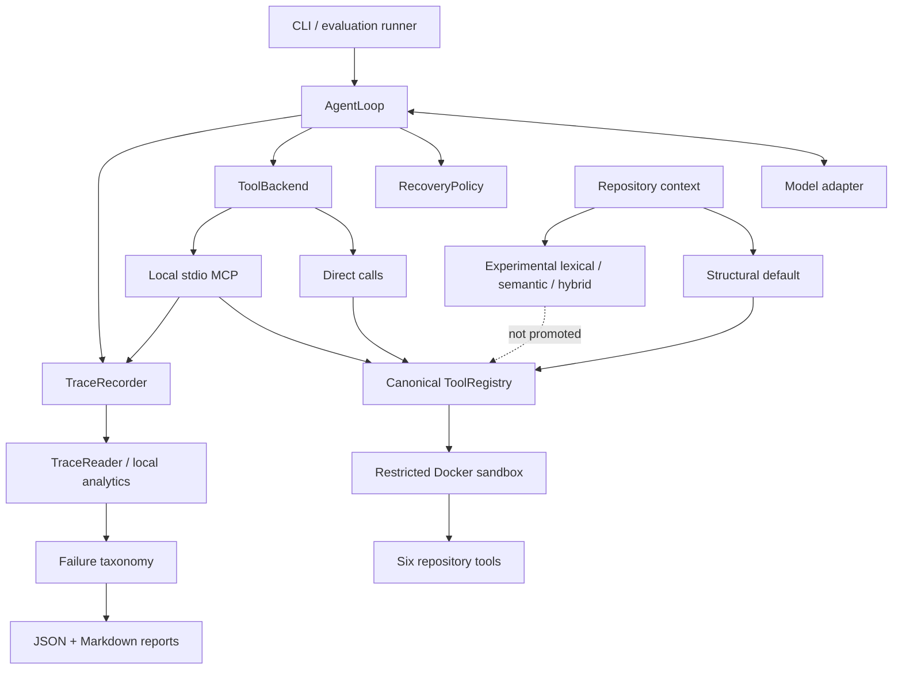

# RepoPilot

RepoPilot is a local **Agent Engineering & Evaluation Platform** for building, observing, testing, and evaluating repository-level coding agents under controlled execution. It connects an issue to bounded repository context, a single-agent tool-calling loop, six typed tools, a restricted Docker sandbox, versioned traces, evidence-based failure classification, and separate deterministic, live-model, reliability, and SWE-bench Verified evaluation tracks.

```text
issue → repository context → model decision → typed tool → restricted sandbox
      → patch / test / bounded recovery → structured trace → evaluation
```

The project is designed to make agent behavior inspectable and falsifiable. It is not presented as a production service or as broad evidence of SWE-bench performance.

## What RepoPilot demonstrates

- A bounded single-agent controller with typed model actions and explicit stop conditions.
- Exactly six repository tools; no model-visible shell, Docker flags, or host paths.
- Restricted, networkless Docker execution over a staged repository copy.
- A canonical tool catalog shared by direct provider calls and a local stdio MCP adapter.
- Versioned JSONL traces with local analytics, redaction, and metric reconciliation.
- Versioned evaluation profiles and an evidence-based, multi-label failure taxonomy.
- Bounded recovery policies tested through deterministic fault injection.
- Structural, lexical, semantic, and hybrid retrieval experiments with a preserved negative promotion result.
- Controlled hidden-test evaluation and separately reported SWE-bench Verified reference, feasibility, behavioral, and qualification tracks.
- Frozen model/controller compatibility gates that measure protocol use independently from coding-task success.

## Architecture



The sandbox and canonical registry remain authoritative on both direct and MCP paths. MCP changes transport, not permissions. Semantic and hybrid retrieval exist for offline comparison but are not the default.

## Agent execution loop

The controller runs an inspect → locate → plan → edit → test → recover → finalize cycle. The model proposes structured actions; the controller validates them, dispatches tools, tracks workspace revisions and budgets, records evidence, and independently collects the final test result and diff.

Recovery is policy-driven rather than an unrestricted retry loop. Default controller limits include 30 model iterations, three edit/test repair cycles, bounded tool timeouts, bounded observations and patches, and a five-minute soft total deadline. A model’s textual success claim is never treated as test evidence.

## Six controlled tools

| Tool | Capability | Main controls |
|---|---|---|
| `list_files` | Enumerate files and return bounded repository context | Relative paths; file, symbol, and character limits |
| `search_code` | Literal or regex search | Query, match, output, and file-size limits |
| `read_file` | Read numbered line ranges | Workspace resolution and line limits |
| `apply_patch` | Apply a validated patch | Path and size validation; protected tests; no symlink or rename patches |
| `run_tests` | Run the controller-approved pytest command | Fixed argv policy and timeout; no model-selected shell command |
| `git_diff` | Return changed files and a bounded diff | Fixed Git argv and bounded output |

Schemas, descriptions, validation rules, mutation metadata, and normalized results come from one canonical catalog. Direct providers and MCP expose the same six definitions. The model never receives arbitrary shell access, and `run_tests` remains controller- or policy-owned.

## Security and sandbox boundary

RepoPilot stages regular files into a separate run directory; it does not mount or modify the original repository. The agent sandbox uses:

- network mode `none`;
- a non-root UID/GID and read-only container root filesystem;
- one staged writable repository mount;
- all Linux capabilities dropped and `no-new-privileges`;
- CPU, memory, PID, command-timeout, and controller-deadline bounds;
- no Docker socket, host home, SSH agent, or forwarded API credentials;
- host- and container-side path checks, patch validation, and protected-test policy;
- immutable controller-owned test plans for qualified SWE-bench environments.

The integration suite inspects the live container configuration. This is defense in depth, not a claim that Docker is a VM-grade security boundary; repository tests still execute arbitrary code inside the container.

## MCP interoperability

`repopilot mcp-serve` implements a local stdio MCP server over the existing registry and sandbox. It exposes exactly the six public tools above. Lifecycle helpers, raw Docker operations, arbitrary filesystem access, and model-selected test commands are not exposed.

Contract tests verify direct/MCP schema parity and normalized success, error, and revision semantics. One controlled end-to-end task passed through the MCP adapter with the same final diff, public result, hidden result, final revision, six calls, and zero unnecessary calls as the direct path. A 100-call fake-backend microbenchmark measured **0.069 ms median** and **0.108 ms p95** adapter overhead per call. Those numbers are adapter-only local microbenchmark evidence; they exclude model, Docker, and sandbox execution time.

RepoPilot does not implement remote MCP transport, production MCP deployment, or arbitrary third-party MCP tool installation.

## Observability and traces

Each run writes an append-only `trajectory.jsonl` plus a reconciled `run.json`. The V2 event envelope includes:

- schema, run, trace, event, span, and parent-span identifiers;
- model, tool, controller, run, and evaluation phases;
- normalized status and structured error metadata;
- iteration, duration, workspace revision before/after, and event origin;
- provider-reported input, output, cached, and reasoning tokens when available;
- final status, stop reason, changed files, and test state.

The streaming reader validates V2 events and normalizes historical V1 trajectories. Local analytics derive tool counts, model/tool latency, token usage, workspace revisions, final state, and stop reason, then reconcile them with `run.json`. `trace-summary` emits deterministic JSON and Markdown. Redaction covers credential-shaped keys and common secret patterns before artifacts are written.

This is local structured observability, not distributed tracing or OpenTelemetry.

## Evaluation profiles and failure taxonomy

Evaluation profiles are versioned, data-only JSON. Defaults resolve before execution; unknown fields and invalid values fail before sandbox startup. Reports record the profile identity, resolved configuration, and content hash.

The versioned taxonomy covers setup, model, tool, policy, retrieval, edit, test, controller, and evaluation/harness failures. A result may retain multiple simultaneous labels. Each classification records phase, observable signal, recoverability, outcome impact, attribution confidence, and evidence event IDs.

The evidence model keeps four concepts separate:

- **observable fact:** something directly present in a trace or report;
- **deterministic classification:** a reproducible rule over trace evidence;
- **benchmark-oracle classification:** a conclusion requiring hidden/reference data;
- **manual hypothesis:** a possible explanation that is not treated as fact.

Validated controlled runs produced zero false task-failure labels and zero unclassified structured errors. That is scoped evidence for the frozen fixtures and rules, not a promise of complete classification for arbitrary future failures.

## Reliability and recovery

Recovery decisions use operation class, retryability, execution state, remaining deadline, retry budget, and workspace revision. The policy distinguishes:

- a bounded retry for a known pre-execution safe-read failure;
- returning rejected or invalid actions to the model without automatic replay;
- bounded provider retry only for retryable pre-execution failures;
- policy-controlled test-timeout handling;
- immediate stop for exhausted or non-recoverable conditions;
- reconciliation rather than replay when a mutation may already have executed.

The ambiguous mutation case is the central state-safety example:

```text
apply_patch may have executed, but its response was lost
    → do not replay the mutation
    → inspect workspace revision and git_diff
    → confirm repository state
    → continue without a duplicate edit
```

The frozen deterministic reliability matrix passed **8/8 expected scenarios**: **6/6 declared recoverable scenarios recovered**, and **2/2 declared non-recoverable scenarios stopped as expected**. Unsafe retries, duplicate mutations, revision divergence, budget overshoots, and unclassified errors were all zero. This establishes behavior only for the injected scenarios; it is not a production reliability or availability claim.

## Repository context and retrieval experiment

The default `list_files` context is an issue-ranked Python AST map containing modules, imports, classes, functions, methods, signatures, source/test roles, and line numbers. It is bounded and deterministic; `search_code` and `read_file` remain available for exact evidence.

RepoPilot also implements lexical retrieval, local semantic retrieval, and hybrid rank fusion. Embeddings use a bounded ephemeral cache; there is no vector database, persistent retrieval service, or remote embedding API.

The frozen eight-case offline comparison produced:

| Strategy | R@1 | R@3 | R@5 | MRR |
|---|---:|---:|---:|---:|
| Structural | 0.375 | 0.625 | 1.000 | 0.573 |
| Semantic | 0.375 | 0.750 | 1.000 | 0.604 |
| Hybrid | 0.375 | 0.625 | 1.000 | 0.594 |

Semantic retrieval improved MRR and uniquely recovered one predeclared paraphrase case at R@3. Promotion required two unique recoveries. The Phase 6 gate therefore **failed**: no live structural-versus-hybrid comparison ran, no held-out tuning followed the result, and structural retrieval remained the default. The negative result is preserved in [P1_CHECKPOINT.json](docs/checkpoints/P1_CHECKPOINT.json).

## SWE-bench Verified integration

RepoPilot keeps real-world evidence in separate tracks because they answer different questions.

### Reference integrity

Five pinned SWE-bench Verified definitions passed **5/5** checkout and reference/test-patch integrity validation. This verifies benchmark plumbing and immutable revisions, not agent behavior or task resolution.

### First feasibility cohort

Three instances were frozen before qualification. Flask and pytest passed gold, security, contamination, trusted-plan, and six-tool checks; a Requests instance failed the official gold/environment gate. Result: **2/3 feasible**. No failed instance was replaced.

### First behavioral pilot

Two authorized instances received exactly one frozen `mistral:7b` attempt each. Result: **0/2 resolved**, with two empty predictions. The model emitted plan-only behavior and made **zero model-originated tool calls**; four recorded calls were controller-owned final test/diff collection. There were no reruns, substitutions, or post-result tuning. This diagnosed a tool-initiation incompatibility; two tasks are not a meaningful estimate of general coding ability.

This remains useful historical development evidence, but it is superseded as RepoPilot's latest external behavioral evidence by the fresh DeepSeek Cohort 2 pilot below.

### Fresh DeepSeek cohort qualification

A new three-task cohort was selected from ten unused candidates before environment testing. Official gold grading passed **3/3**, and security and contamination gates passed. The frozen qualification result was **1/3 — STOP PILOT**:

- pytest was rejected because the frozen test plan encountered warning-policy failure behavior;
- Requests was rejected because its frozen suite required httpbin/network access;
- Matplotlib qualified.

The failed tasks were not replaced or retuned. **DeepSeek was not run.** Details are in the [qualification checkpoint](docs/checkpoints/DEEPSEEK_SWEBENCH_COHORT_QUALIFICATION.md).

### Fresh Cohort 2 qualification and behavioral pilot

Cohort 2 began with a fresh, frozen pool of 17 unused SWE-bench Verified instances across nine repository families. A uniform environment-only pre-screen considered pinned image availability, exact-base reproducibility, local image size, and whether one of at most five hash-ranked tracked test files passed under the unchanged networkless sandbox. It did not use gold patches, expected-fix metadata, difficulty labels, prior model outcomes, or solve-likelihood judgments. **7/17** instances were eligible.

Five instances were then selected by a frozen deterministic hash ordering, with at most two from one repository family. All five passed exact-base staging, trusted test plans, the six-tool environment smoke, security and contamination gates, and official gold sanity: **5/5 qualified and 5/5 gold-resolved**. No failed candidate was substituted and the cohort was frozen before DeepSeek ran.

Each qualified instance received exactly one `deepseek-v4-pro` attempt under the unchanged prompt, six tools, structural retrieval, 30-iteration controller budget, recovery policy, sandbox, and official SWE-bench harness. There were no reruns, substitutions, post-hoc tuning, or manual patch repairs.

| Frozen instance | Official result | F2P | P2P | Controller outcome |
|---|---|---:|---:|---|
| `mwaskom__seaborn-3187` | Unresolved; empty patch | unavailable | unavailable | `iteration_limit` |
| `pydata__xarray-6938` | Unresolved; empty patch | unavailable | unavailable | `iteration_limit` |
| `pylint-dev__pylint-7277` | **Resolved** | 1/1 | 122/122 | `tests_passed` |
| `sphinx-doc__sphinx-8551` | **Resolved** | 1/1 | 32/32 | `tests_passed` |
| `sphinx-doc__sphinx-9230` | **Resolved** | 1/1 | 44/44 | `tests_passed` |

**RepoPilot resolved 3/5 tasks in a frozen five-instance SWE-bench Verified behavioral pilot with official grading.** Both unresolved attempts exhausted the frozen 30-iteration budget and produced empty patches. The evidence supports those observable facts; it does not support a stronger root-cause claim. Empty predictions provide no patch for the official harness to execute, so their F2P/P2P counts are unavailable rather than inferred.

This five-task pilot is external behavioral evidence, not an estimate of broad SWE-bench Verified performance. It is not a 60% general solve-rate claim, a leaderboard comparison, or production-readiness evidence. The frozen [qualification](docs/checkpoints/DEEPSEEK_SWEBENCH_COHORT2_QUALIFICATION.md) and [behavioral report](docs/checkpoints/DEEPSEEK_SWEBENCH_COHORT2_BEHAVIORAL.md) preserve the full protocol and limitations.

RepoPilot therefore demonstrates SWE-bench reference validation, selective environment qualification, security/contamination gating, prediction export, official grading integration, and frozen one-shot behavioral evaluation. Broad SWE-bench performance is not established.

## Model/controller compatibility

The first behavioral pilot showed that a valid environment and nominal tool-capable endpoint do not guarantee that a model will operate the controller protocol. RepoPilot therefore added a frozen 12-case gate covering tool initiation, action validity, sequencing, observation handling, correction, state awareness, and finalization.

| Frozen gate | `mistral:7b` | `deepseek-v4-pro` |
|---|---:|---:|
| Strict decision | **NOT COMPATIBLE** | **NOT COMPATIBLE** |
| First valid tool-call rate | 0% | 100% |
| Protocol-complete rate | 0/12 | 9/12 (75%) |
| Plan-only loop rate | 83.3% | 0% |
| Successful finalization | 2/12 | 12/12 |

Mistral produced 43 plan actions, two final actions, and zero model tool calls; the plan-only behavior reproduced outside SWE-bench. DeepSeek initiated tools in every tool-required case and had no plan-only loops, but missed three exact sequence-conformance requirements. The predeclared strict threshold was at least 80%, so its permanent strict verdict remains **NOT COMPATIBLE**.

A separately frozen evidence review classified DeepSeek’s three misses as non-safety-critical for a tightly bounded pilot and returned **ADMITTED FOR SMALL BEHAVIORAL PILOT**. That is a distinct decision, not an adjusted threshold or compatibility pass. The first fresh cohort then failed qualification and stopped before execution; the independently selected Cohort 2 later qualified 5/5 and produced the separately reported 3/5 behavioral result. Neither event revises the strict 9/12 verdict.

These gates measure compatibility with RepoPilot’s protocol, not general model quality or software-engineering intelligence.

## Measured results

| Track | Measured result | What it establishes | What it does not establish |
|---|---|---|---|
| Controlled deterministic benchmark | 12/12 task, public, and hidden success; localization F1 1.00; 72 calls; 0 unnecessary | Controller, tools, sandbox, traces, hidden scoring, and reports | Model intelligence |
| Controlled DeepSeek coding run | 12/12 task/public/hidden; F1 1.00; 80 calls, 1 unnecessary | One frozen live-model run on small synthetic tasks | Strict protocol compatibility or broad coding performance |
| MCP parity/security | 23 selected tests passed; one direct/MCP task matched; 0.069 ms median adapter-only overhead | Local stdio contract and behavior parity | Remote or production MCP deployment |
| Reliability matrix | 8/8 scenarios; 6/6 recoverable; all unsafe-state counters zero | Frozen injected recovery behavior | Availability under arbitrary failures |
| Retrieval experiment | Semantic MRR 0.604 vs structural 0.573; promotion gate failed | Reproducible offline comparison and negative-result discipline | Live task improvement |
| SWE-bench reference integrity | 5/5 | Pinned checkout and reference/test-patch applicability | Agent solves |
| First SWE-bench feasibility | 2/3 | Two sandbox-compatible environments | General environment coverage |
| First SWE-bench behavioral pilot | 0/2; empty predictions; zero model tool calls | Diagnosed Mistral tool-initiation failure | Meaningful coding-capability estimate |
| Mistral compatibility | NOT COMPATIBLE; 0/12 protocol complete | Protocol mismatch under the frozen gate | General model ranking |
| DeepSeek strict compatibility | **NOT COMPATIBLE; 9/12 (75%), threshold ≥80%** | Stronger tool use but failed exact frozen threshold | A compatibility pass |
| DeepSeek behavioral admission | ADMITTED FOR SMALL BEHAVIORAL PILOT | No safety/reliability-critical deviation in reviewed evidence | SWE-bench success |
| Earlier fresh DeepSeek cohort | Gold 3/3; qualification 1/3; **STOP PILOT** | Qualification gates correctly blocked execution | DeepSeek behavioral SWE-bench evidence |
| Fresh Cohort 2 qualification | **5/5 qualified; 5/5 official gold sanity** from a frozen 17-instance pool with 7/17 pre-screen eligible | Five reproducible, security-gated environments selected without solve evidence | Agent task success or general environment coverage |
| Fresh Cohort 2 behavioral | **3/5 officially resolved**; one attempt per task; no reruns, substitutions, tuning, or manual repair | External one-shot behavioral evidence on this frozen subset | A 60% general solve rate, leaderboard comparability, or production readiness |

The deterministic and live-model success rates are intentionally not merged.

## Reproduce

Requirements: Python 3.11+, Docker with a running daemon, and `uv`.

```bash
uv sync --extra dev
uv run pytest
```

Run the deterministic controlled benchmark:

```bash
uv run repopilot eval \
  --benchmarks benchmarks/cases \
  --output reports/deterministic \
  --model scripted
```

Run RepoPilot on a local Python/pytest repository. Credentials remain in the host process and are not forwarded into Docker:

```bash
export OPENAI_API_KEY="your-host-only-value"
uv run repopilot run /absolute/path/to/repository \
  --issue "Describe the bug and expected behavior" \
  --provider openai \
  --model YOUR_MODEL \
  --output /absolute/path/outside-the-repository/repopilot-runs
```

Validate and summarize a V1 or V2 trace:

```bash
uv run repopilot trace-summary /absolute/path/to/trajectory.jsonl \
  --output reports/trace-summary
```

Serve the six tools over local stdio MCP:

```bash
uv run repopilot mcp-serve /absolute/path/to/repository \
  --issue "Describe the task" \
  --output /absolute/path/outside-the-repository/mcp-runs
```

Run the deterministic reliability matrix and offline retrieval comparison:

```bash
uv run repopilot reliability --output reports/reliability

uv run repopilot retrieval-eval \
  --strategies structural lexical semantic hybrid \
  --output reports/retrieval
```

Validate the five pinned real-world definitions. This uses network access for public checkout and validates reference integrity; it is not a behavioral SWE-bench run:

```bash
uv run repopilot real-validate \
  --tasks benchmarks/real_world \
  --output reports/real-world-reference
```

Run the frozen local model/controller compatibility profile:

```bash
uv run python -m repopilot.evaluation.model_compatibility \
  --profile configs/evaluation/model_compatibility.json \
  --output reports/model-compatibility
```

The compatibility command is a synthetic protocol gate, not a coding benchmark. The frozen SWE-bench behavioral pilots are preserved checkpoint workflows rather than a general-purpose CLI benchmark command.

## Design trade-offs and limitations

- RepoPilot is a local, single-agent Python/pytest-oriented system, not a production service.
- It has no distributed execution, persistent memory, database, UI, Kubernetes layer, or production deployment claim.
- MCP is local stdio only; the direct path remains the normal internal controller path.
- Structural retrieval remains the default. Semantic/hybrid retrieval was implemented but failed its promotion gate.
- The controlled benchmark is small and scripted evaluation validates infrastructure, not intelligence.
- Reliability evidence is limited to the eight deterministic injected scenarios.
- External behavioral evidence now exists: RepoPilot resolved 3/5 tasks in the frozen Cohort 2 pilot under official grading, but five tasks and one attempt each provide no variance estimate or broad solve-rate evidence.
- Two Cohort 2 attempts exhausted the frozen 30-iteration budget without editing and produced empty patches; no unsupported root cause is inferred.
- SWE-bench environment compatibility remains selective under the strict networkless sandbox and trusted-plan boundary: an earlier fresh cohort stopped at 1/3 qualification even though Cohort 2 later qualified 5/5.
- The first behavioral pilot remains historical evidence: it resolved 0/2 because the frozen local Mistral model did not initiate tools, and it is superseded as the latest behavioral result by Cohort 2.
- DeepSeek's strict compatibility verdict remains **NOT COMPATIBLE at 9/12**. Its separate behavioral-admission decision remains **ADMITTED FOR SMALL BEHAVIORAL PILOT**; neither decision is retroactively changed by the 3/5 result.
- Synchronous provider calls can finish after the soft controller deadline when already in flight. RepoPilot does not claim hard cancellation.
- Local embeddings use an ephemeral bounded cache; there is no vector database or remote embedding service.
- Docker isolation is not equivalent to a VM-grade security boundary.

## Project scope and non-goals

The current milestone deliberately excludes multi-agent orchestration, persistent memory, arbitrary shell access, remote MCP, dashboards, databases, broad language support, distributed infrastructure, Kubernetes, and a UI. Future ideas in [V2_SPEC.md](docs/V2_SPEC.md) are design context only; the claims above describe only implemented and measured behavior.

The repository is frozen for the current job-search milestone. Negative results and stopped gates are retained as engineering evidence rather than rewritten as successes.
